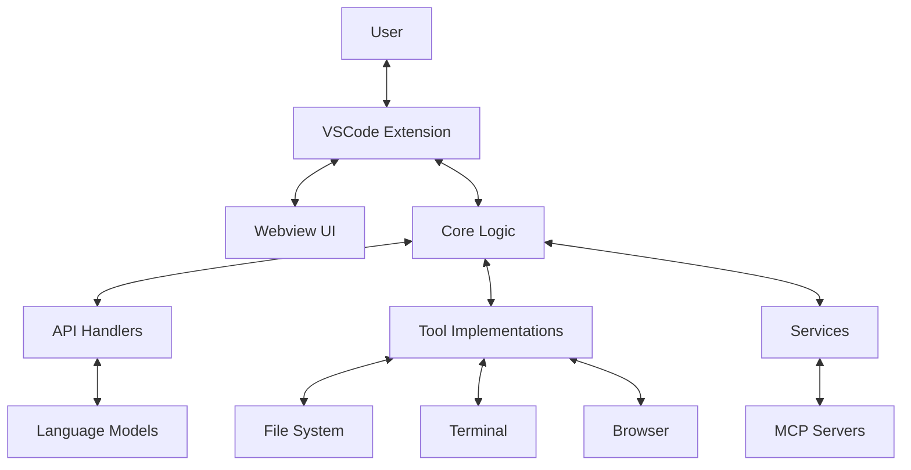

# System Patterns: Cline VSCode Extension

## System Architecture

Cline follows a modular architecture with clear separation of concerns:

### Key Components

1. **VSCode Extension**: The main entry point that integrates with VSCode
2. **Webview UI**: React-based user interface for interaction
3. **Core Logic**: Manages task execution, conversation flow, and tool coordination
4. **API Handlers**: Interfaces with various language model providers
5. **Tool Implementations**: Provides functionality for file operations, terminal commands, etc.
6. **Services**: Handles cross-cutting concerns like logging, authentication, etc.
7. **MCP Integration**: Connects to external MCP servers for extended capabilities

## Key Technical Decisions

### 1. TypeScript as Primary Language
- Provides type safety and better developer experience
- Integrates well with VSCode extension API
- Enables better code organization and maintainability

### 2. React for Webview UI
- Component-based architecture for the chat interface
- Efficient rendering for responsive user experience
- Familiar framework for contributors

### 3. Provider-Based API Architecture
- Abstraction layer for different language model providers
- Allows easy addition of new providers
- Consistent interface regardless of underlying model

### 4. Permission-Based Tool Execution
- All tools require explicit permission or auto-approval configuration
- Provides security and user control
- Prevents unintended actions

### 5. Model Context Protocol (MCP)
- Standardized protocol for extending capabilities
- Server-based approach for adding new tools and resources
- Enables community contributions without core changes

### 6. Checkpoint System
- Git-based tracking of workspace changes
- Enables rollback to previous states
- Provides safety net for users

## Design Patterns in Use

### 1. Command Pattern
- Tool implementations follow a command pattern
- Each tool encapsulates a specific action
- Uniform interface for execution and result handling

### 2. Provider Pattern
- API providers implement a common interface
- Allows runtime selection of different providers
- Simplifies adding new language model integrations

### 3. Observer Pattern
- Event-based communication between components
- VSCode extension listens for webview events
- Terminal and file system changes trigger updates

### 4. Factory Pattern
- Creation of API handlers and tools through factories
- Centralizes instantiation logic
- Simplifies configuration and dependency injection

### 5. Strategy Pattern
- Different strategies for handling various language models
- Format conversion strategies for different API responses
- Allows swapping implementations without changing client code

### 6. Singleton Pattern
- Single instances for services like logging and authentication
- Ensures consistent state across the application
- Centralizes resource management

## Component Relationships

### Extension and Webview
- Extension hosts the webview and manages its lifecycle
- Communication via message passing
- Extension provides access to VSCode APIs

### Core and Tools
- Core orchestrates tool execution
- Tools report results back to core
- Core maintains conversation context and history

### API Handlers and Language Models
- Handlers format requests for specific models
- Stream responses back to core
- Handle model-specific error cases

### MCP Integration
- Core connects to MCP servers
- Exposes server tools and resources to the language model
- Handles authentication and communication

## Error Handling Strategy
- Graceful degradation when tools fail
- Clear error messages for users
- Automatic retry for transient failures
- Checkpoints for recovery from critical errors

## Security Considerations
- Permission-based access to file system and terminal
- .clineignore for excluding sensitive files
- Sanitization of inputs to prevent injection attacks
- Local execution of all tools (no remote code execution)
